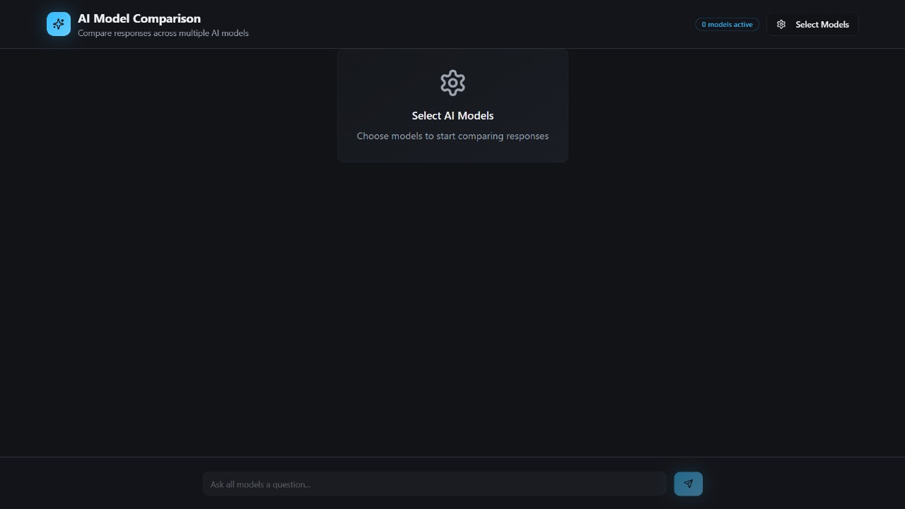
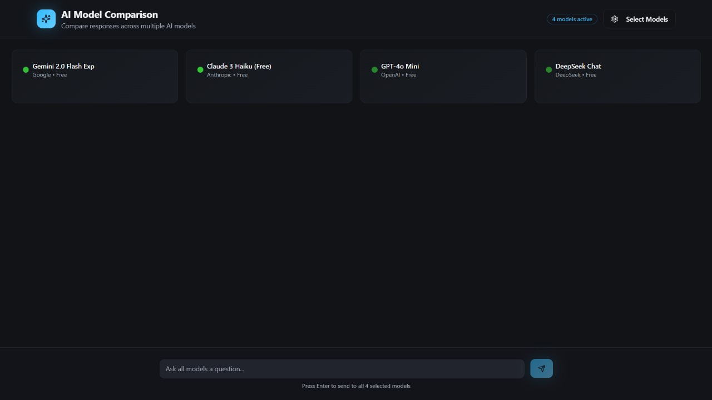
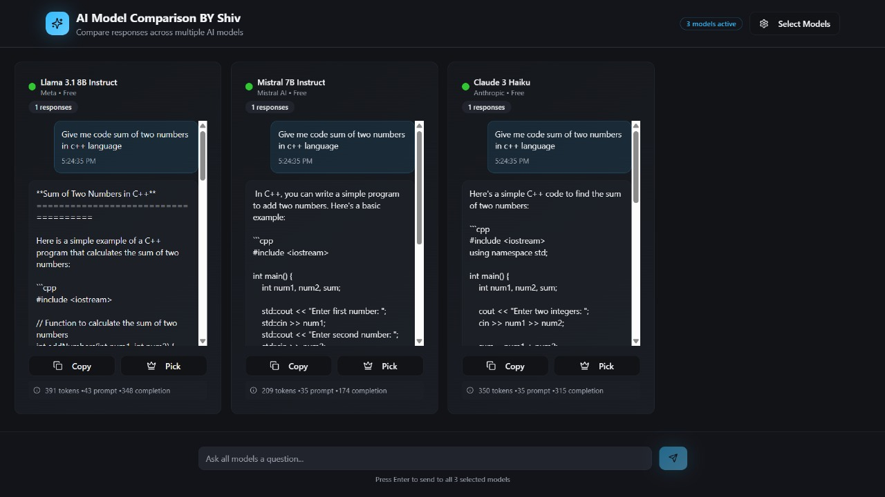

# AI Model Comparison Tool 🚀


A powerful web application to **compare responses from multiple AI models simultaneously** using OpenRouter's unified API. Built with **React**, **TypeScript**, **shadcn/ui**, and **Tailwind CSS**.

---

## ✨ Features

- Multi-Model Comparison: Send the same message to multiple AI models at once
- Real-time Responses: View responses from all models simultaneously
- Model Selection: Choose from GPT-4, Claude, Gemini, Llama, Mistral, and more
- Response Evaluation: Pick the best response and copy it
- Usage Tracking: Monitor token usage per model
- Beautiful UI: Modern, responsive interface
- TypeScript: Full type safety for reliable development

---

## 🤖 Supported Models

- **OpenAI**: GPT-4o, GPT-4o Mini
- **Anthropic**: Claude 3.5 Sonnet, Claude 3 Haiku
- **Google**: Gemini Pro
- **Meta**: Llama 3.1 (8B & 70B Instruct)
- **Mistral AI**: Mistral 7B Instruct
- **Perplexity**: Llama 3.1 8B
- **Nous Research**: Nous Hermes 2 Mixtral

---

## 🖼️ Screenshots

  
*Main AI comparison interface with real-time responses*

  
*Select the AI models you want to compare*

  
*Pick the best response and copy it*

---

## 🚀 Getting Started

### Prerequisites

- Node.js 18+ and npm
- OpenRouter API key

### 1. Clone the Repository

```bash
git clone https://github.com/yourusername/ai-model-comparison-tool.git
cd ai-model-comparison-tool
npm install
```

### 2. Configure API Key

Create a `.env` file in the project root:

```env
VITE_OPENROUTER_API_KEY=sk-or-v1-your-api-key-here
```

> Or configure it inside the app UI.

### 3. Start Development Server

```bash
npm run dev
```

Open [http://localhost:5173](http://localhost:5173) in your browser.

---

## 📖 Usage

1. Configure OpenRouter API key (if not set via `.env`)
2. Select AI models to compare
3. Type your question and hit Enter
4. Compare responses in real-time
5. Pick the best response and copy it

---

## 🏗️ Project Structure

```
src/
├── components/
│   ├── AIModelComparison.tsx
│   ├── ModelChat.tsx
│   ├── ModelSelector.tsx
│   ├── ApiKeyConfig.tsx
│   └── ui/
├── hooks/
│   ├── use-chat.ts
│   └── use-toast.ts
├── lib/
│   ├── openrouter.ts
│   └── utils.ts
└── pages/
    └── Index.tsx
```

---

## 🛠️ Technologies

- **Frontend**: React 18, TypeScript, Vite
- **UI**: shadcn/ui, Tailwind CSS
- **State**: React Hooks
- **Forms**: React Hook Form, Zod
- **Icons**: Lucide React
- **API**: OpenRouter API, OpenAI SDK

---

## 🔧 Scripts

- `npm run dev` - Start development server
- `npm run build` - Build for production
- `npm run preview` - Preview production build
- `npm run lint` - Run ESLint

---

## 🔒 Security

- API keys are stored locally in browser `localStorage`
- For production, implement a backend proxy
- **Never commit API keys** to GitHub

---

## 🤝 Contributing

1. Fork the repo
2. Create a feature branch: `git checkout -b feature/xyz`
3. Commit your changes: `git commit -m "Add new feature"`
4. Push to branch: `git push origin feature/xyz`
5. Open a Pull Request

---

## 📝 License

This project is licensed under the [MIT License](LICENSE).

---

## 🙏 Acknowledgments

- [OpenRouter](https://openrouter.ai/) – Access to multiple AI models
- [shadcn/ui](https://ui.shadcn.com/) – UI components
- [Vite](https://vitejs.dev/) – Fast build tool
- [Tailwind CSS](https://tailwindcss.com/) – Utility-first CSS

---

## 📞 Support

Open an issue on GitHub for questions or help.
